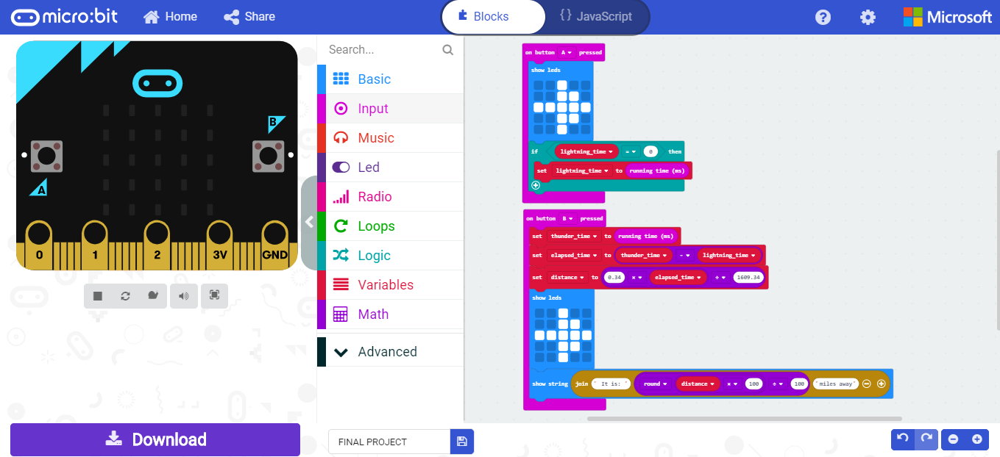

# SoarCS 2019!

<!-- Note, the line below this one is what links to your screenshot, **DO NOT REMOVE** -->

<!--
In this file, you should write a brief description of what your
project is, what you learned, and a simple screenshot of your work.

To add a screenshot, please replace `screenshot.png` with
your own screenshot.
-->

## <The Lightning Range Finder>

This project will accurately tell you how far a lighting strike is from you to the hundreth decimal place. By pressing the A button whenever you see the flash, and the B button as soon as you hear the thunder you will be presented with the range in miles. We came up with this idea in the dorm rooms on the night of the big thunder storms, then the next day we made the code using conversions and the distance formula.
